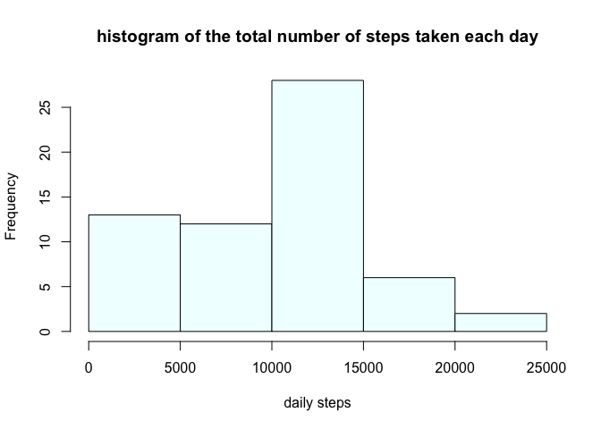

## Loading and preprocessing the data

```r
ds <- read.csv("activity.csv", na.strings = "NA")
ds[,"date"] <- lubridate::ymd(ds$date)
ds[,"steps"] <- as.numeric(ds[,"steps"])
```


## What is mean total number of steps taken per day?

```r
library(dplyr)
daily <- ds %>% group_by(date) %>% summarize(total_steps = sum(steps,na.rm = TRUE))
hist(daily$total_steps, xlab = "daily steps", main = "histogram of the total number of steps taken each day", col = "azure")
```

<!-- -->
  
The mean and median of the total number of steps taken per day are as follow    

```r
mean(daily$total_steps, na.rm = TRUE)
```

```
## [1] 9354.23
```

```r
median(daily$total_steps, na.rm = TRUE)
```

```
## [1] 10395
```
  
## What is the average daily activity pattern?

```r
daily_int <- ds %>% group_by(interval) %>% summarize(avg_steps = mean(steps,na.rm = TRUE))
plot(daily_int$interval,daily_int$avg_steps,type = "l", xlab = "5-min intervals", ylab = "average daily steps")
```

<!-- -->

The 5-minute interval that, on average across all the days in the dataset, contains the maximum number of steps is

```r
daily_int$interval[daily_int$avg_steps == max(daily_int$avg_steps)]
```

```
## [1] 835
```
  
## Imputing missing values
The total number of missing values in the dataset (i.e. the total number of rows with NAs) is

```r
sum(is.na(ds$steps))
```

```
## [1] 2304
```
  
New dataset **ds1** is created which is equal in size to the original dataset (ds) but with the missing data filled in with the mean for that 5-minute interval.

```r
ds1 <-data.frame()
for(i in 1:nrow(ds)){
        int <-ds[i,"interval"]
        if (is.na(ds[i,"steps"])){
                ds1<-rbind(ds1, data.frame(steps = daily_int$avg_steps[daily_int$interval== int], date = ds[i,"date"], interval = int))
        }else {ds1<-rbind(ds1,data.frame(steps = ds[i,"steps"], date = ds[i,"date"], interval = int))}
}
str(ds1)
```

```
## 'data.frame':	17568 obs. of  3 variables:
##  $ steps   : num  1.717 0.3396 0.1321 0.1509 0.0755 ...
##  $ date    : Date, format: "2012-10-01" "2012-10-01" ...
##  $ interval: int  0 5 10 15 20 25 30 35 40 45 ...
```
Histogram and mean/median calculations with the new dataset **ds1**

```r
daily1 <- ds1 %>% group_by(date) %>% summarize(total_steps = sum(steps,na.rm = TRUE))
```

```
## `summarise()` ungrouping output (override with `.groups` argument)
```

```r
hist(daily1$total_steps, xlab = "daily steps", main = "histogram of the total number of steps taken each day", col = "azure")
```

<!-- -->


```r
mean(daily1$total_steps, na.rm = TRUE)
```

```
## [1] 10766.19
```

```r
median(daily1$total_steps, na.rm = TRUE)
```

```
## [1] 10766.19
```

The impact of imputing missing data on the estimates of the total daily number of steps is shown below

```r
par(mfrow = c(1,2))
hist(daily$total_steps, xlab = "daily steps", main = "original dataset", col = "azure", ylim = c(0,35))
hist(daily1$total_steps, xlab = "daily steps", main = "NA filled dataset", col = "azure")
```

<!-- -->

```r
t <- data.frame(mean = c(mean(daily$total_steps, na.rm = TRUE),mean(daily1$total_steps, na.rm = TRUE)), median = c(median(daily$total_steps, na.rm = TRUE),median(daily1$total_steps, na.rm = TRUE)), row.names = c("original dataset","NA filled dataset"))
print(t)
```

```
##                       mean   median
## original dataset   9354.23 10395.00
## NA filled dataset 10766.19 10766.19
```
## Are there differences in activity patterns between weekdays and weekends?
New factor variable is created in the dataset (ds1) with two levels – “weekday” and “weekend” indicating whether a given date is a weekday or weekend day.

```r
ds1 <- ds1 %>% mutate(day = ifelse((weekdays(date) == "Saturday"|weekdays(date)== "Sunday"),"weekend","weekday"))
table(ds1$day)
```

```
## 
## weekday weekend 
##   12960    4608
```


```r
daily_int1 <- ds1 %>% group_by(interval, day) %>% summarize(avg_steps = mean(steps,na.rm = TRUE))
ggplot2::qplot(interval,avg_steps,data = daily_int1, facets = day ~.,geom = "line", xlab = "5-min intervals", ylab = "average daily steps")
```

<!-- -->
